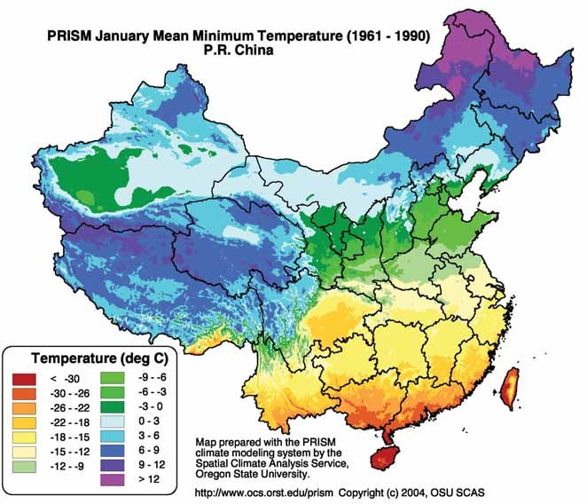

<body style="background-color:lightgrey;">


### Introduction
#### Abstract
The **_Huai River Policy_** is a Chinese policy that provides free (or highly subsidized) coal for residents north of the river since the policy's institution in 1950. 

According to the empirical conclusions from Ebenstein et. al in a [PNAS research paper](https://www.pnas.org/doi/10.1073/pnas.1616784114#sec-4), the analysis suggests that the Huai River Policy has had an adverse effect on human health. The policy led to PM10 concentrations being at levels that are 46 percent higher in the north and a reduce life expectancy by 3.1 years (caused by cardiorespiratory mortality). In general, the research suggests that an additional 10 μg/m3 of PM10 is associated with a 0.64-year decrease in life expectancy. 

The implications of these findings predict that Chinese-compliance to their Class I PM10 standard (of  40 μg/m3) would lead to an increase of 3.7 billion life-years for their current population. In addition, less resources would be required for dedication to pollution-related issues on both the individual and national levels.

#### Personal Thoughts
It would be interesting to see if there is any research that can predict what the total loss of human life would be in the absence of these policies.
- Also leads to a deeper question regarding how to define what is a "good policy" -- total life years, total number of pollutant-related deaths, 
- i.e.: If the Huai River policy was never enacted (and as a result more people died annually during winter-months due to insufficient heating capabilities), how would those figures compare to the figures from this research design and reality in China today?

#### Data Prep
Loading packages 
```{r}
pacman::p_load( # Package manager for installing/loading
   dplyr,       # For cleaning/wrangling syntax
   magrittr,     # For pipes
   ggplot2,       # For graphing/visuals
   ggpubr      # For arranging/formatting graphs
   )
```


Loading data
```{r}
# HTML included in script above to limit bright-light eye strain

# Reading data
river = haven::read_dta("huairiver.dta")

# Modify column names for easier reference
river %<>% rename(
   id = 1,
   wind = 2,
   precip = 4,
   north_of_river=5
)
```
### Question 1 - Why would a simple analysis comparing northern vs souther cities be inaccurate?

Cities that are further north have colder winter temperatures. Lower winter temperatures means more demand for heat (essential for not freezing to death) which means more demand for energy and thus more demand for particulate-emitting coal-burning that contribute to higher PM10 levels.

Even if the Huai River policy did not exist, it would be likely that we would see higher PM10 concentrations in areas further-north. The image below provides an overview of mean January temperatures in China over the specified time interval. 
  

Regression discontinuity design is able to overcome this issue because it allows for analysis of populations that are receiving a given treatment versus populations that are included in the control group. 


*LIMITATIONS OF EXISTING STUDIES*
- Literature is composed of observational studies that include confounding variables (e.g. health effects associated with pollution exposure)
- Current evidence looks largely at populations with modest levels of PM common among developing countries
- Limited evidence and research surrounding long-term exposure effects

*WAYS IN WHICH PREVIOUS LIMITATIONS WERE ADDRESSED*
- Research design based on China's Huai River Policy
- Average PM10 concentrations in China are five-times higher than the WHO standard
- The Huai River Policy results in sustained differences in PM10 between both sides of the river that have persisted since data was first collected
   - Also includes periods of loosened migration-restrictions 


### Question 2 - What are the outcome and assignment variables in Fig.2 of the Ebenstein et.al paper?

The _**outcome variable**_ is `pm10`, the value of which is the average PM10 level (measured in μg/m3) for the given county-code.

The _**assignment variable**_ (i.e. "running variable") is 


### Question 3 - What is a binned scatter plot?

A __*binned scatter plot*__ is a plot where data points for a given variable are grouped into bins and then an aggregate statistics is used to summarize each bin. It is thus known as a non-parametric way of obtaining E[Y|X] (i.e. the conditional expectation of *Y* given *X*)


### Question 4

Creating a scatter plot, creating groups based on distance to river
```{r}
# Creating bin for each mile
river_round = river %>% group_by(dist_huai) %>%
   round(digits = 0) %>% # making another df to avoid potential errors since I'm 
   ungroup()             # working on the questions out of order 
ggplot(data=river_round,aes(x=river_round$dist_huai,y=river_round$pm10)) +
   geom_point()+
   geom_smooth(method = "lm", color="blue",se=F)+
   geom_smooth(method = "loess", color="red",se=F)
```

Since there is an outlier value at `dist_huai = 2`, it would taking another look to see how the predicted regression values change if we remove the single value.

Looking at the data we can see that outlier is associated with `id = 653221`, so now removing that row and running the same code for the graph above
```{r}
river_round %>% filter(id!=653221)%>%
   ggplot(data=.,aes(x=.$dist_huai,y=.$pm10)) +
      geom_point()+
      geom_smooth(method = "lm", color="blue",se=F)+
      geom_smooth(method = "loess", color="red",se=F)+
      ylim(0,308) # to preserve graph proportions for comparing plots
```

Even if the outlier is removed, the regression predictions change by an amount small amount. In the scope of this analysis, it is important to consider the significance in the shapes of each line. The blue line has a positive slope, from which we can use to support the notion of counties that are further north of the river are associated with higher levels of `PM10`. The red line representing a loess regression has a convex shape, which predicts that there is a positive correlation between distance to the Huai river `PM10` concentration up until a few miles north of the river, where the trend begins again in the opposite direction.

We can also look at how the graph would change if we change display the data by methodologically creating bins (rather than simply plotting the rounded distance) or we could look at the same plotting as the graphs above, but with absolute value. Doing so may lose the value of the the distinction of which side of the river an observation is on, but would also help reassure us of other trends that may exist in the data (plus we could create a binary variable indicating if a given observation is north or south of the river)
```{r, message=FALSE, warning=FALSE}
# This time using the non-rounded data to preserve some additional information
# lost by rounding

# Considering range of value in distance
range(river$dist_huai) # apprx. -12.78 and 16.48 for min/max
diff(range(river$dist_huai)) # apprx. 29.25

# Also removing outlier from original df, saving for later if wanted
outlier_obs = river %>% filter(id==653221)
river %<>% filter(id!=653221)
```

```{r, message=FALSE, warning=FALSE}
# Making a bin for approximately each degree
plot1 = ggplot(river, aes(x=dist_huai,y=pm10)) +
  geom_point(size=2, alpha = 0.1, color="red") +
  stat_summary_bin(fun.y='mean', bins=30, # Bin for each mile, similar to 
                   color='blue', size=2, geom='point')+ # plots above
   geom_smooth(method = "lm", color="blue",se=F)+
   geom_smooth(method = "loess", color="red",se=F, size=.75)+
   theme(axis.title.x = element_blank(),
         axis.title.y = element_blank())

# Arbitrarily large number of bins
plot2 = ggplot(river, aes(x=dist_huai,y=pm10)) +
  geom_point(size=2, alpha = 0.1, color="red") +
  stat_summary_bin(fun.y='mean', bins=75, 
                   color='blue', size=1.5, geom='point')+
   geom_smooth(method = "lm", color="blue",se=F)+
   geom_smooth(method = "loess", color="red",se=F, size=.75)+
   theme(axis.title.x = element_blank(),
         axis.title.y = element_blank())

# Arbitrarily small number of bins
plot3 = ggplot(river, aes(x=dist_huai,y=pm10)) +
  geom_point(size=2, alpha = 0.1, color="red") +
  stat_summary_bin(fun.y='mean', bins=10, 
                   color='blue', size=2, geom='point')+
   geom_smooth(method = "lm", color="blue",se=F)+
   geom_smooth(method = "loess", color="red",se=F, size=.75)+
   theme(axis.title.x = element_blank(),
         axis.title.y = element_blank())

# Arbitrary number of bins using absolute values for distance
plot4 = ggplot(river, aes(x=abs(dist_huai),y=pm10)) +
  geom_point(size=2, alpha = 0.1, color="red") +
  stat_summary_bin(fun.y='mean', bins=75, 
                   color='blue', size=1.5, geom='point')+
   geom_smooth(method = "lm", color="blue",se=F)+
   geom_smooth(method = "loess", color="red",se=F, size=.75)+
   theme(axis.title.x = element_blank(),
         axis.title.y = element_blank())

ggarrange(plot1, plot2, plot3, plot4,vjust=1,hjust=-4,labels = "AUTO",
          font.label = list(size=10, face="bold.italic",
                            color = "navy")) %>%
   annotate_figure(.,
   left = text_grob("Average PM10 level (μg/m3)",
      color = "black",rot = 90,face="bold"),
   bottom = text_grob("Distance from Huai River (degrees North)",
      color = "black",face="bold")) %>%
               annotate_figure(.,
            bottom = text_grob("Figure (D.) scale in absolute values",
               color = "black",face="italic",
               hjust = -1.25,vjust = -5, size = 6)) -> plot4x_pm
plot4x_pm
```

Now graphically illustrating the correlation between distance from the river and temperature, precipitation, and changes in wind speed
```{r temp, message=FALSE, warning=FALSE}
## Temperature

# Note: I am reusing plot1:4 naming conventions for the sake of less
# computational strain

# Making a bin for approximately each degree
plot1 = ggplot(river, aes(x=dist_huai,y=temp)) +
  geom_point(size=2, alpha = 0.1, color="red") +
  stat_summary_bin(fun.y='mean', bins=30, # Bin for each mile, similar to 
                   color='blue', size=2, geom='point')+ # plots above
   geom_smooth(method = "lm", color="blue",se=F)+
   geom_smooth(method = "loess", color="red",se=F, size=.75)+
   theme(axis.title.x = element_blank(),
         axis.title.y = element_blank())

# Arbitrarily large number of bins
plot2 = ggplot(river, aes(x=dist_huai,y=temp)) +
  geom_point(size=1.5, alpha = 0.1, color="red") +
  stat_summary_bin(fun.y='mean', bins=75, 
                   color='blue', size=1.5, geom='point')+
   geom_smooth(method = "lm", color="blue",se=F)+
   geom_smooth(method = "loess", color="red",se=F, size=.75)+
   theme(axis.title.x = element_blank(),
         axis.title.y = element_blank())

# Arbitrarily small number of bins
plot3 = ggplot(river, aes(x=dist_huai,y=temp)) +
  geom_point(size=2, alpha = 0.1, color="red") +
  stat_summary_bin(fun.y='mean', bins=10, 
                   color='blue', size=2, geom='point')+
   geom_smooth(method = "lm", color="blue",se=F)+
   geom_smooth(method = "loess", color="red",se=F, size=.75)+
   theme(axis.title.x = element_blank(),
         axis.title.y = element_blank())

# Arbitrary number of bins using absolute values for distance
plot4 = ggplot(river, aes(x=abs(dist_huai),y=temp)) +
  geom_point(size=2, alpha = 0.1, color="red") +
  stat_summary_bin(fun.y='mean', bins=75, 
                   color='blue', size=1.5, geom='point')+
   geom_smooth(method = "lm", color="blue",se=F)+
   geom_smooth(method = "loess", color="red",se=F, size=.75)+
   theme(axis.title.x = element_blank(),
         axis.title.y = element_blank())

ggarrange(plot1, plot2, plot3, plot4,vjust=1,hjust=-4,labels = "AUTO",
          font.label = list(size=10, face="bold.italic",
                            color = "navy")) %>%
   annotate_figure(.,
   left = text_grob("Average Temperature (°F)",
      color = "black",rot = 90,face="bold"),
   bottom = text_grob("Distance from Huai River (degrees North)",
      color = "black",face="bold")) %>%
               annotate_figure(.,
            bottom = text_grob("Figure (D.) scale in absolute values",
               color = "black",face="italic",
               hjust = -1.25,vjust = -5, size = 6)) -> plot4x_temp
plot4x_temp
```

```{r precip, message=FALSE, warning=FALSE}
## Precipitation

# Making a bin for approximately each degree
plot1 = ggplot(river, aes(x=dist_huai,y=precip)) +
  geom_point(size=2, alpha = 0.1, color="red") +
  stat_summary_bin(fun.y='mean', bins=30, # Bin for each mile, similar to 
                   color='blue', size=2, geom='point')+ # plots above
   geom_smooth(method = "lm", color="blue",se=F)+
   geom_smooth(method = "loess", color="red",se=F, size=.75)+
   theme(axis.title.x = element_blank(),
         axis.title.y = element_blank())

# Arbitrarily large number of bins
plot2 = ggplot(river, aes(x=dist_huai,y=precip)) +
  geom_point(size=2, alpha = 0.1, color="red") +
  stat_summary_bin(fun.y='mean', bins=75, 
                   color='blue', size=1.5, geom='point')+
   geom_smooth(method = "lm", color="blue",se=F)+
   geom_smooth(method = "loess", color="red",se=F, size=.75)+
   theme(axis.title.x = element_blank(),
         axis.title.y = element_blank())

# Arbitrarily small number of bins
plot3 = ggplot(river, aes(x=dist_huai,y=precip)) +
  geom_point(size=2, alpha = 0.1, color="red") +
  stat_summary_bin(fun.y='mean', bins=10, 
                   color='blue', size=2, geom='point')+
   geom_smooth(method = "lm", color="blue",se=F)+
   geom_smooth(method = "loess", color="red",se=F, size=.75)+
   theme(axis.title.x = element_blank(),
         axis.title.y = element_blank())

# Arbitrary number of bins using absolute values for distance
plot4 = ggplot(river, aes(x=abs(dist_huai),y=precip)) +
  geom_point(size=1.5, alpha = 0.1, color="red") +
  stat_summary_bin(fun.y='mean', bins=75, 
                   color='blue', size=1.5, geom='point')+
   geom_smooth(method = "lm", color="blue",se=F)+
   geom_smooth(method = "loess", color="red",se=F, size=.75)+
   theme(axis.title.x = element_blank(),
         axis.title.y = element_blank())

ggarrange(plot1, plot2, plot3, plot4,vjust=1,hjust=-4,labels = "AUTO",
          font.label = list(size=10, face="bold.italic",
                            color = "navy")) %>%
   annotate_figure(.,
   left = text_grob("Average Precipitation (mm)",
      color = "black",rot = 90,face="bold"),
   bottom = text_grob("Distance from Huai River (degrees North)",
      color = "black",face="bold")) %>%
               annotate_figure(.,
            bottom = text_grob("Figure (D.) scale in absolute values",
               color = "black",face="italic",
               hjust = -1.25,vjust = -5, size = 6)) -> plot4x_precip
plot4x_precip
```

```{r wind, message=FALSE, warning=FALSE}
## Wind speed

# Making a bin for approximately each degree
plot1 = ggplot(river, aes(x=dist_huai,y=wind)) +
  geom_point(size=2, alpha = 0.1, color="red") +
  stat_summary_bin(fun.y='mean', bins=30, # Bin for each mile, similar to 
                   color='blue', size=2, geom='point')+ # plots above
   geom_smooth(method = "lm", color="blue",se=F)+
   geom_smooth(method = "loess", color="red",se=F, size=.75)+
   theme(axis.title.x = element_blank(),
         axis.title.y = element_blank())

# Arbitrarily large number of bins
plot2 = ggplot(river, aes(x=dist_huai,y=wind)) +
  geom_point(size=2, alpha = 0.1, color="red") +
  stat_summary_bin(fun.y='mean', bins=75, 
                   color='blue', size=1.5, geom='point')+
   geom_smooth(method = "lm", color="blue",se=F)+
   geom_smooth(method = "loess", color="red",se=F, size=.75)+
   theme(axis.title.x = element_blank(),
         axis.title.y = element_blank())

# Arbitrarily small number of bins
plot3 = ggplot(river, aes(x=dist_huai,y=wind)) +
  geom_point(size=2, alpha = 0.1, color="red") +
  stat_summary_bin(fun.y='mean', bins=10, 
                   color='blue', size=2, geom='point')+
   geom_smooth(method = "lm", color="blue",se=F)+
   geom_smooth(method = "loess", color="red",se=F, size=.75)+
   theme(axis.title.x = element_blank(),
         axis.title.y = element_blank())

# Arbitrary number of bins using absolute values for distance
plot4 = ggplot(river, aes(x=abs(dist_huai),y=wind)) +
  geom_point(size=1.5, alpha = 0.1, color="red") +
  stat_summary_bin(fun.y='mean', bins=75, 
                   color='blue', size=1.5, geom='point')+
   geom_smooth(method = "lm", color="blue",se=F)+
   geom_smooth(method = "loess", color="red",se=F, size=.75)+
   theme(axis.title.x = element_blank(),
         axis.title.y = element_blank())

# Arranging plots
ggarrange(plot1, plot2, plot3, plot4,vjust=1,hjust=-4,labels = "AUTO",
          font.label = list(size=10, face="bold.italic",
                            color = "navy")) %>%
   annotate_figure(.,
   left = text_grob("Average Wind Speed (m/s)",
      color = "black",rot = 90,face="bold"),
   bottom = text_grob("Distance from Huai River (degrees North)",
      color = "black",face="bold")) %>%
               annotate_figure(.,
            bottom = text_grob("Figure (D.) scale in absolute values",
               color = "black",face="italic",
               hjust = -1.25,vjust = -5, size = 6)) -> plot4x_wind
plot4x_wind
```


### Question 5 - Regression Analysis

Suppose we create the following predictive models using `lm` and `LOESS ` regression to predict a given variable based 
```{r}
## PM10
# LOESS 
pm10.L = loess(formula = pm10 ~ dist_huai,
                  data = river)
# LM
pm10.lm = lm(formula = pm10 ~ dist_huai,
                 data = river)

## Precipitation
# LOESS 
precip.L = loess(formula = precip ~ dist_huai,
                 data = river)
# LM
precip.lm = lm(formula = precip ~ dist_huai,
               data = river)

## Temperature
# LOESS 
temp.L = loess(formula = temp ~ dist_huai,
               data = river)
# LM
temp.lm = lm(formula = temp ~ dist_huai,
             data = river)

## Wind
# LOESS 
wind.L = loess(formula = wind ~ dist_huai, 
               data = river)
# LM
wind.lm = lm(formula = wind ~ dist_huai,
             data = river)
```

Which would make the following predictions:

```{r}
predict(pm10.L, newdata = river,interval = "confidence")

summary(wind.L)

# Adding columns of predictions to data frame
river %>% 
   modelr::spread_predictions(.,
                              pm10.L, pm10.lm,
                              precip.L, precip.lm,
                              temp.L, temp.lm,
                              wind.L, wind.lm,
                              type = NULL)
```

With a table displaying the confidence intervals for each model
```{r}
confint(pm10.lm, interval="predict",level = .95) -> temp
summary(pm10.L)

```

```{r}
predict(pm10.lm, newdata = river, interval = 'prediction')

kableExtra::kbl(river[, c(1,6,2,4,5)])
```


### Question 6

### Question 7 

### Question 8

### Sources
- https://www.researchgate.net/figure/January-mean-minimum-temperature-of-China-as-modelled-by-PRISM_fig4_268323552
